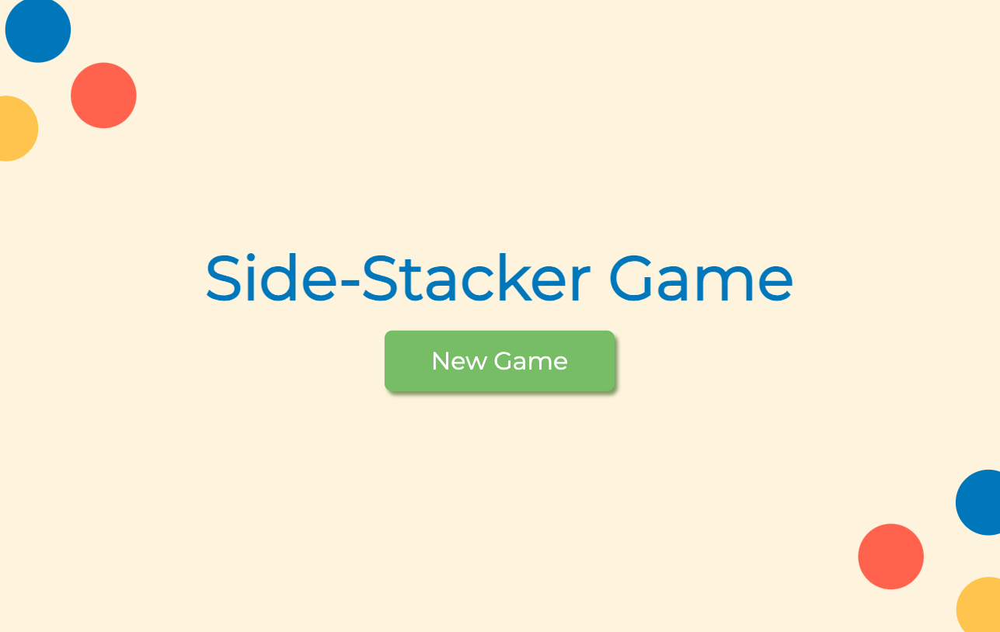
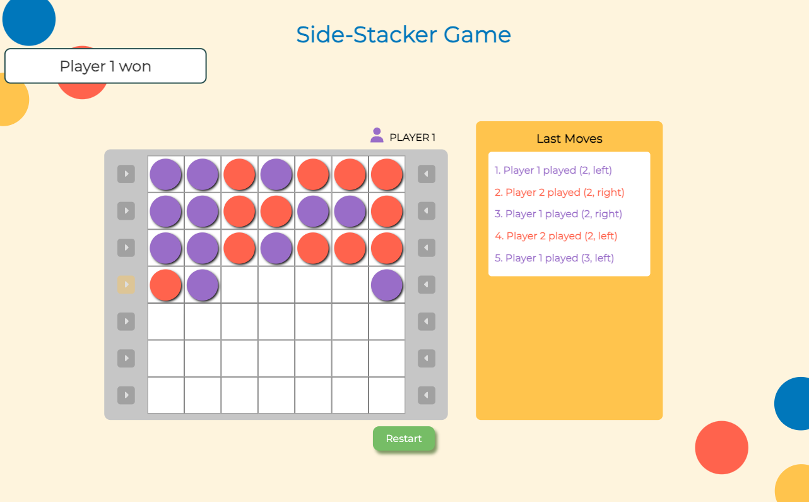
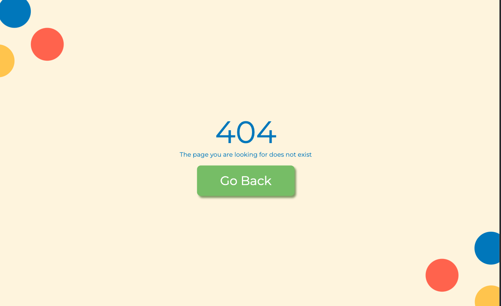
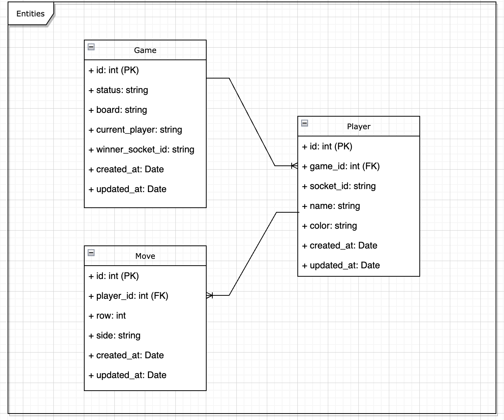

# The Side-Stacker Game - Backend

The Side-Stacker Game is a 2-player game in which the pieces stack on top of each other, and the game ends when there are no spaces left available, or when a player has four consecutive pieces on a diagonal, column, or row.

The full project consists in two parts:

- A frontend developed using React with TypeScript
- A backend developed using NodeJS and TypeScript

Both projects connect each other real time using socket.io implementations and persist data in a PostgreSQL database.

## Quickstart

Prerequisites:
[Node(v18.16.0) and NPM](https://docs.npmjs.com/downloading-and-installing-node-js-and-npm) or [Docker](https://docs.docker.com/get-docker/) and [Docker-compose](https://docs.docker.com/compose/install/#install-using-pip)

First of all, we need to have a postgres instance running on the machine.

If you don't have one, you'll need to have Docker and Docker-Compose, since the docker-compose in the root directory comes with a database instance called sidestacker-db which you can run using the command:

- docker compose -f docker/docker-compose.yml --env-file ./.env up sidestacker-db

You can run the project locally in two ways:

### `Using NPM`

In the root directory of the project, you can run:

- npm ci -> install the dependencies using the package-lock.json to preserve the dependency versions.
- npm run dev -> runs the project in the port 4200 by default.

Open [http://localhost:4200/health](http://localhost:4200/health) to view a basic health check of the api in the browser.

You can also set another port using the PORT environment variable in a .env file in the root directory of the project.

The project will reload if you make edits.\
You will also see any lint errors in the console.

The project has also a pre-commit system you can activate using

- npm run prepare:husky

You can also test the project using the following command:

- npm test

This will run the unit tests for the project using Jest and TS-Jest. The coverage of the tests in this project is more than 80%.

To build the project you can run:

- npm run build

and then:

- npm start -> runs the transpiled bundle at port 4200 by default (or the port you choose in the .env file)

### `Using Docker`

You can also run this project using Docker and Docker Compose.
In the root directory of the project, you first need to set the environment variables in a .env file (as shown in the .env.example file):

- NODE_ENV=
- PORT=
- FRONTEND_URL=
- POSTGRES_HOST=
- POSTGRES_USER=
- POSTGRES_PASSWORD=
- POSTGRES_DB=
- POSTGRES_PORT=
- PGADMIN_DEFAULT_EMAIL=
- PGADMIN_DEFAULT_PASSWORD=

Once the environment variables are set, you can run:

- docker compose -f docker/docker-compose.yml --env-file ./.env up {{service_name}}

Where service_name is one of the services in the docker-compose: sidestacker-backend, sidestacker-db and sidestacker-pgadmin

This will bootstrap and expose the container to http://localhost:PORT

### The Game

The game has three main views:

The Home View from which you can start the game (remember you need two players i.e. two tabs of the application open)

And the board, in which you can play using the arrows on each side of the board. The moves board will show the last 5 moves made in the game

You can always use the restart button to start a new game with the same two players.

There is also a not found page to redirect whenever you enter a wrong url in the game

## `Caveats`

- When one of the players disconnects (or restarts the page) the game is closed
- When the game is restarted the board is automatically updated
- Each move is real time and you don't need to reload the page to see the changes

### `Database`

The application uses a PostgresDB database to record data about the game (this data could be used for instance to generate statistics or to train ML models).

To make this process easier, it is provided one database using the docker-compose.yml file, which is adapted to create one Postgres database on port 5432 and a PGAdmin instance on port 5050. You can always change this ports in the environment variables.

The first time you enter to the PGAdmin platform (use http://localhost:5050) you've got to set up the database server. Use the name of the service set in the docker-compose "sidestacker-db" as the host (since all these services lie within the same Docker network defined in the docker-compose). Then, enter the user, password and port. You will see the server in the Servers list, in the top left corner of the sidebar.

The database has three tables: Game, Player and Moves to save a record of each game with its players and moves.

You are ready to go!
